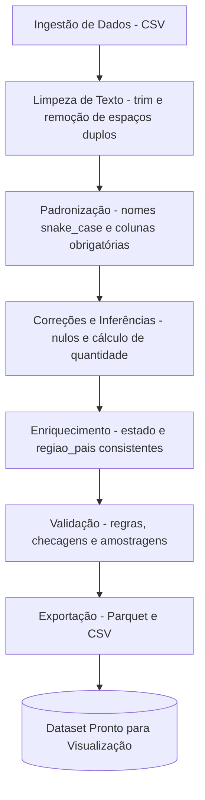

# 📊 Resumo dos Ajustes de Qualidade de Dados em Python

Este documento resume as transformações e limpezas aplicadas aos datasets ao longo do projeto, visando garantir **acurácia**, **consistência** e **prontidão para visualização**.

## 1. **Tratamento de Espaços e Caracteres**

- **Remoção de espaços extras** em nomes de campos e valores.
    
    - Exemplo: `"Santa Catarina"` → `"Santa Catarina"`.
        
- **Padronização de acentos** e remoção de caracteres especiais via `unidecode` para facilitar buscas e cruzamentos.
    
- **Trim** (remoção de espaços em branco no início e fim de strings) aplicado em todas as colunas de texto.
    

## 2. **Padronização de Colunas**

- Uniformização dos nomes das colunas para **snake_case** (ex.: `Região País` → `regiao_pais`).
    
- Inclusão de campos obrigatórios no parquet final:
    
    - `centro_distribuicao`
        
    - `responsavel_pedido`
        
    - `cod_pedido`
        

## 3. **Correção e Inferência de Valores Ausentes**

- Cálculo automático da coluna **quantidade** quando ausente:
    
    python
    
    CopiarEditar
    
    `quantidade = valor_total_bruto / valor_unitario`
    
- Substituição de valores nulos ou inválidos (`#N/A`, `(nullo)`, `(não atribuído)`) por `#` quando definido em regra de negócio.
    
- Garantia de que colunas como **fornecedor_id**, **detalhe_id**, **centro_custo_id** e **essencialidade_id** possuam valores padrão `#` conforme solicitado.
    

## 4. **Enriquecimento de Dados**

- Inclusão de **região_pais** e **estado** limpos e padronizados, garantindo compatibilidade com outras dimensões.
    
- Garantia de consistência entre **versão de categoria** e **campo categoria** para integração com SAC.
    

## 5. **Formatos e Exportações**

- Geração de arquivos **Parquet** e **CSV** contendo todos os campos originais mais os campos enriquecidos.
    
- Uso de `pyarrow` com compressão `snappy` para otimizar tamanho e performance na leitura.
    

## 6. **Validação Final**

- Checagem de colunas obrigatórias antes do salvamento.
    
- Comparação amostral entre a base original e a tratada para garantir que **nenhuma informação relevante foi perdida** no processo.
    
- Logs informativos durante a execução para rastrear cada transformação.
    

---

✅ **Resultado esperado**: dataset final **limpo**, **padronizado** e **pronto** para ser usado em dashboards e análises visuais, garantindo consistência entre dimensões e fatos.

# Etapas

flowchart LR
B(Date Dim) === C{Fact Table}
D(Symbol Dim) === C{Fact Table}
E(Company Dim) === C{Fact Table}
C{Fact Table} -.Stock Values.-> A[Measures]
A[Measures] === Z[Calculations]

