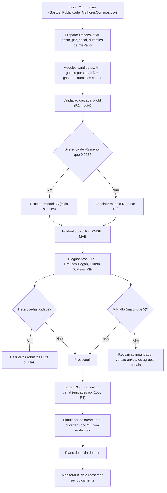

Sugiro que você entregue em **3 partes**:

### 🔹 Parte 1 – Técnica

Código Python (importar CSV, matriz de correlação, scatterplots, regressão).
## Etapa 001 - Importar Csv


# Etapa 001 - - - - importar CSV
````python
# Etapa 001 - - - - importar CSV
from pathlib import Path
import pandas as pd

CSV_PATH = "https://raw.githubusercontent.com/regis-zang/TrbFiap25_Cap05/main/sample/Gastos_Publicidade_MelhoresCompras.csv"
``````

# Etapa 002 -  - - - Lendo em Data Frame

````python
# Etapa 002 - - - - importar CSV
df_raw = pd.read_csv(CSV_PATH)
``````

- **Lendo o arquivo CSV** que está no endereço definido em `CSV_PATH` (nesse caso, a URL do GitHub).
- **Criando um DataFrame chamado `df_raw`** — que passa a conter todos os dados da planilha `Gastos_Publicidade_MelhoresCompras.csv`.

# Etapa 003 - - - Exibindo Estrutura
````python
# Etapa 003- - - Exibindo Estrutura
print(df_raw.shape)
df_raw.head()
``````

**`print(df_raw.shape)`** → mostra o **formato da tabela**, ou seja:

- número de linhas (registros, observações)
- número de colunas (variáveis, campos)
**`df_raw.head()`** → retorna as **5 primeiras linhas** da tabela.

- Serve para inspecionar rapidamente se os dados foram carregados corretamente.
- Mostra também os nomes das colunas e alguns valores de exemplo
![[Pasted image 20250820200108.png]]

- Prints dos gráficos e tabela de coeficientes.

# Etapa 004 - - - Normalizando Dados
````python
#Etapa 004 - - - Normalizando Dados
import unicodedata

def _norm(s: str) -> str:
    s = s.strip().lower()
    s = ''.join(ch for ch in unicodedata.normalize('NFD', s) if unicodedata.category(ch) != 'Mn')

    s = s.replace('-', ' ').replace('/', ' ')
    return ' '.join(s.split())

normcols = {_norm(c): c for c in df_raw.columns}

def pick(*opts):

    for o in opts:

        if o in normcols:

            return normcols[o]

    raise KeyError(f"Não achei nenhuma coluna: {opts}")
  

COL_ANO   = pick('ano')
COL_MES   = pick('mes')
COL_MIDIA = pick('tipo de midia', 'tipo de midia ')
COL_GASTO = pick('gastos com publicidade (em r$)', 'gastos com publicidade em r$', 'gastos com publicidade')
COL_ALVO  = pick('previsao inicial de aumento de vendas (em mil unidades)',
                 'previsao inicial de aumento de vendas em mil unidades')

df = df_raw[[COL_ANO, COL_MES, COL_MIDIA, COL_GASTO, COL_ALVO]].copy()
df.columns = ["ano", "mes", "tipo_midia", "gasto", "aumento_vendas_mil"]

for c in ["ano", "mes", "gasto", "aumento_vendas_mil"]:
    df[c] = pd.to_numeric(df[c], errors="coerce")

print(df.shape)

df.head()
``````


## 🔎 Passo a passo

1. **Normalização de nomes de colunas**
    
    - A função `_norm()`:
        
        - deixa tudo em minúsculas
        - remove acentos (`publicidade` vs `publicidadé`)
        - substitui traços e barras por espaço
        - tira espaços duplicados
    - Isso garante que você consiga identificar colunas mesmo que tenham pequenas variações no nome.
        
2. **Mapeamento de colunas**
    
    - `normcols = {_norm(c): c for c in df_raw.columns}` cria um **dicionário de correspondência** entre nomes normalizados e nomes originais.
    - A função `pick(*opts)` procura um nome de coluna dentro do dicionário e retorna o nome real da tabela.
    - Isso dá flexibilidade: se a planilha vier com `"Gastos com Publicidade"` ou `"Gastos com Publicidade (em R$)"`, o código vai encontrar.
        
3. **Seleção das colunas principais**
    
    - Ele garante que só vai trabalhar com:
        - `ano`
        - `mes`
        - `tipo de mídia`
        - `gastos`
        - `aumento de vendas`
    
    `df = df_raw[[COL_ANO, COL_MES, COL_MIDIA, COL_GASTO, COL_ALVO]].copy()`
    
4. **Renomeia as colunas** para algo mais amigável:
    
    `ano, mes, tipo_midia, gasto, aumento_vendas_mil`
    
5. **Conversão de tipos numéricos**
    
    - Força as colunas `ano`, `mes`, `gasto`, `aumento_vendas_mil` a serem `int/float`.
    - Caso encontre valores inválidos, transforma em `NaN` (`errors="coerce"`).
6. **Exibe informações**
    
    - `print(df.shape)` mostra as dimensões da nova base.
    - `df.head()` mostra as primeiras 5 linhas já limpas e padronizadas.

![[Pasted image 20250820200831.png]]

## Considerações:
1. **Dimensão da base**
       - `(200, 5)` significa que você tem **200 registros** e **5 variáveis**.
       - Isso é suficiente para rodar análises estatísticas básicas e regressão linear.
        
2. **Colunas disponíveis**
    - `ano` → vai de 2022 até (provavelmente) 2024.
    - `mes` → varia de 1 a 12.
    - `tipo_midia` → categórica (Páginas web, Redes sociais, TV, Jornal, Revista, Rádio, Instagram).
    - `gasto` → valores em reais investidos em cada campanha.
    - `aumento_vendas_mil` → variável alvo (ROI esperado em milhares de unidades vendidas).
        
3. **Qualidade dos dados (nas 5 primeiras linhas)**
       - Não há nulos.
       - Tipos numéricos já estão convertidos (`float` para gasto, `int` para ano/mês, ROI).
       - `tipo_midia` é texto → precisará ser transformada em variáveis dummy (one-hot encoding) antes da regressão.
  
4. **Primeiros insights visuais**
    
    - Exemplo: em **janeiro/2022**:
           - TV recebeu **R$ 250.000** e teve ROI de **+1.500 mil unidades vendidas** (1,5M).
        - Redes sociais recebeu **R$ 120.000** para ROI de **+800 mil unidades**.
        - Revista com **R$ 40.000** trouxe apenas **+360 mil unidades**.
       - Já dá pra perceber que o **custo-benefício (ROI por real investido)** pode variar bastante entre os canais.
        
## Considerações finais
👉 Portanto, é **correto afirmar que sua base já está limpa e estruturada para regressão**, e os primeiros exemplos sugerem que **cada mídia pode ter eficiência diferente no aumento de vendas**, algo que será confirmado (ou não) pela matriz de correlação e pelo modelo de regressão linear.

# Etapa 005 - - - Checagem de Problemas

````python
# Etapa 005 - - - Checagem de Problemas
print("NA por coluna:")
print(df.isna().sum())
print("\nDescribe numérico:")
display(df.describe())
print("\nValores únicos de tipo_midia:")
sorted(df["tipo_midia"].dropna().unique())
``````

![[Pasted image 20250820201646.png]]

![[Pasted image 20250904203124.png]]

![[Pasted image 20250904203146.png]]
## Considerações finais
Em resumo: esse código está **checando se há problemas de dados (nulos, inconsistências), analisando estatísticas descritivas e identificando as categorias de mídia**.
Ou seja, sua base está **praticamente limpa**, mas você tem **3 registros sem valor de gasto**.

### Atenção aos 3 `NaN` em `gasto`
Você viu que `gasto` tem 3 nulos. Do jeito que o `where` está, **se o `NaN` ocorrer na própria mídia daquela linha**, ele **vira `NaN` também** em `gasto_<midia>` — o que pode quebrar o treino.


# Etapa 006 - - - Separa colunas para analises

````python
# Etapa 006 - - - Separa colunas para analises
def slug(s: str) -> str:

    s2 = ''.join(ch for ch in unicodedata.normalize('NFD', str(s).lower()) if unicodedata.category(ch) != 'Mn')
    return s2.replace(' ', '_')

midias = sorted(df["tipo_midia"].dropna().unique().tolist())
for m in midias:
    col = f"gasto_{slug(m)}"
    df[col] = (df["gasto"].where(df["tipo_midia"] == m, 0.0)).astype(float)

mes_dummies = pd.get_dummies(df["mes"], prefix="mes", drop_first=True)
df_feat = pd.concat([df, mes_dummies], axis=1)
df_feat["ano_trend"] = df_feat["ano"]

# Conjuntos de features que vamos comparar (A/B/C)
feat_A = [c for c in df_feat.columns if c.startswith("gasto_")]
feat_B = feat_A + [c for c in df_feat.columns if c.startswith("mes_")]
feat_C = feat_B + ["ano_trend"]

candidatos = {
    "A_gastos_por_midia": feat_A,
    "B_gastos_e_mes":     feat_B,
    "C_gastos_mes_ano":   feat_C,
}
y = df_feat["aumento_vendas_mil"].values

{nome: len(cols) for nome, cols in candidatos.items()}
``````

**Cria colunas separadas para cada tipo de mídia**

- Em vez de ter uma coluna só chamada "tipo de mídia" (com valores como TV, Redes sociais, Revista…), o código cria uma **coluna para cada canal**:
    
    - `gasto_TV`
    - `gasto_Redes_sociais`
    - `gasto_Revista`
    - … e assim por diante.
- Cada coluna mostra **quanto foi gasto naquele canal em cada mês** (se não foi gasto nada, aparece zero).

**adiciona colunas para os meses**

- O código cria colunas extras chamadas `mes_2`, `mes_3`, … até `mes_12`.
- Isso serve para que o modelo consiga perceber se, em certos meses, as campanhas funcionam melhor ou pior.
- Exemplo: dezembro pode ter mais impacto (Natal) do que julho.

![[Pasted image 20250820202749.png]]

### Para leigos (explicação sem técnico)

👉 É como se tivéssemos montado **três versões da mesma receita de bolo**:

- Receita A: só com o ingrediente “gasto em cada canal”.
    
- Receita B: mesma coisa, mas adicionando “mês do ano”.
    
- Receita C: mesma coisa, mas adicionando também “ano da campanha”.
    

Agora que temos essas **3 receitas prontas**, o próximo passo é **rodar a regressão linear em cada uma delas** e ver:

- Qual delas explica melhor as vendas (maior **R²**).
    
- Quais canais aparecem como os mais eficientes.
### 🔹 Parte 2 – Resultados
# Etapa 007 - - - Analise Cruzada 

- Matriz de correlação (heatmap).

````python
# Etapa 007 - - - Analise Cruzada 
import numpy as np
import matplotlib.pyplot as plt

corr_cols = list(set(feat_C + ["aumento_vendas_mil"]))
df_corr = df_feat[corr_cols].corr(numeric_only=True)
print("Top correlações absolutas com o alvo:")
abs(df_corr["aumento_vendas_mil"]).sort_values(ascending=False).head(10)
# Heatmap simples (sem seaborn)
plt.figure()
im = plt.imshow(df_corr.values, aspect='auto')
plt.colorbar(im, fraction=0.046, pad=0.04)
plt.xticks(range(len(df_corr.columns)), df_corr.columns, rotation=90)
plt.yticks(range(len(df_corr.index)), df_corr.index)
plt.title("Matriz de correlação")
plt.tight_layout()
plt.show()
``````

### 🧠 Explicação para não técnicos

👉 Em termos de marketing:  
Esse código está ajudando a descobrir **quais canais de publicidade têm mais ligação direta com o aumento das vendas**.

- Se a correlação de **Redes sociais** com vendas for próxima de **+0.9**, significa que quando investimos mais lá, as vendas sobem fortemente.
    
- Se a correlação de **Revista** for baixa (ex. 0.1), significa que o investimento nesse canal quase não explica as vendas.
    
- Se fosse negativa (ex. -0.3), seria um alerta: talvez o canal esteja até atrapalhando o resultado (ou drenando verba sem retorno).
![[Pasted image 20250820203241.png]]


### Como isso ajuda na análise

1. **Identificar quais mídias estão mais ligadas ao aumento de vendas**
    
    - Quanto mais claro (amarelo) no cruzamento com `aumento_vendas_mil`, mais forte a relação.
    - Isso ajuda a prever quais canais provavelmente terão **maior peso no modelo de regressão**.
2. **Descobrir variáveis redundantes**
    - Se duas variáveis (ex.: `gasto_TV` e `gasto_Radio`) tiverem correlação muito alta entre si, pode haver **multicolinearidade** (o modelo tem dificuldade de separar o efeito individual de cada uma).

3. **Verificar sazonalidade**

    - As colunas `mes_...` podem mostrar correlações com `aumento_vendas_mil`.
    - Exemplo: dezembro (`mes_12`) pode ter correlação positiva, sinalizando vendas maiores.


- Gráficos de dispersão.
# Etapa 008 - - - Analise Cruzada 
````python
# Etapa 008 - - - Analise Cruzada 
for col in feat_A:

    x = df_feat[col].values
    y_ = df_feat["aumento_vendas_mil"].values

    plt.figure()
    plt.scatter(x, y_, s=12)
    if np.nanmax(x) > 0:
        m, b = np.polyfit(x[~np.isnan(x)], y_[~np.isnan(x)], 1)  # tendência linear
        xs = np.linspace(np.nanmin(x), np.nanmax(x), 100)
        plt.plot(xs, m*xs + b)
    plt.xlabel(col); plt.ylabel("aumento_vendas_mil")
    plt.title(f"Dispersão: {col} x aumento_vendas_mil")
    plt.tight_layout()
    plt.show()
``````

### 🧠 O que isso ajuda a descobrir

- **Se o canal tem relação linear com vendas**
    
    - Exemplo: TV pode mostrar pontos bem alinhados → forte relação.
        
    - Revista pode ter pontos espalhados → pouca relação.
        
- **Se há outliers (gastos atípicos)**
    
    - Se aparece um ponto muito fora da linha, pode indicar uma campanha que não performou como esperado.
        
- **Comparação entre mídias**
    
    - Dá para ver visualmente qual canal tem uma **relação mais consistente** entre investimento e resultado.

### 🎯 Para o time de Marketing

Esses gráficos respondem à pergunta:

> “Se eu investir mais neste canal, minhas vendas tendem a crescer de forma previsível ou não?”

- Se a nuvem de pontos segue a linha de tendência → **bom candidato** para investir.
- Se os pontos estão espalhados e sem padrão → **canal de retorno incerto**.

![[Pasted image 20250820212216.png]]


# Etapa 009 - - - Treina um modelo de Regressão Linear

````python
# Etapa 009 - - - Treina um modelo de Regressão Linear
from sklearn.model_selection import KFold, cross_val_score
from sklearn.linear_model import LinearRegression
from sklearn.metrics import r2_score, mean_squared_error
import numpy as np
import pandas as pd

TARGET = "aumento_vendas_mil"
def limpar_Xy(cols, df_base, target=TARGET):
    """Seleciona colunas, remove NaN/Inf de X e y e retorna matrizes limpas."""
    use_cols = [c for c in cols if c in df_base.columns]
    if not use_cols:
        return None, None, []
    X = df_base[use_cols].copy()
    y = df_base[target].copy()
   # Remove Inf e NaN
    X = X.replace([np.inf, -np.inf], np.nan)
    y = y.replace([np.inf, -np.inf], np.nan)
    mask = X.notna().all(axis=1) & y.notna()
    X = X.loc[mask]
    y = y.loc[mask]

    # Converte para arrays
    Xv = X.values
    yv = y.values

    return Xv, yv, use_cols

def avaliar_cv(X, y, k=5, seed=42):
    """Avalia R² em CV, ajustando k ao número de amostras válidas."""
    n = len(y)
    if n < 3:
        # muito pouco dado para CV
        return np.nan, np.nan
    k_eff = min(k, max(2, n - 1))  # garante pelo menos 2 folds e não estoura n
    kf = KFold(n_splits=k_eff, shuffle=True, random_state=seed)
    model = LinearRegression()
    scores = cross_val_score(model, X, y, cv=kf, scoring="r2", error_score=np.nan)
    return np.nanmean(scores), np.nanstd(scores)

# 1) Saneia listas de features
candidatos_sanit = {}
for nome, cols in candidatos.items():
    existentes = [c for c in cols if c in df_feat.columns]
    faltando   = sorted(set(cols) - set(existentes))
    if faltando:
        print(f"[AVISO] {nome}: ignorando colunas ausentes -> {faltando}")
    if existentes:
        candidatos_sanit[nome] = existentes

if not candidatos_sanit:
    raise ValueError("Nenhuma especificação com features válidas.")

# 2) Loop nas especificações com limpeza de X/y e CV
resultados = []
for nome, cols in candidatos_sanit.items():
    X, y_valid, cols_ok = limpar_Xy(cols, df_feat, target=TARGET)
    if X is None or len(y_valid) < 3:
        print(f"[AVISO] {nome}: sem dados suficientes após limpeza. Pulando.")
        continue

    m, s = avaliar_cv(X, y_valid, k=5, seed=42)
    resultados.append({
        "modelo": nome,
        "n_features": len(cols_ok),
        "n_amostras_validas": len(y_valid),
        "r2_cv_mean": m,
        "r2_cv_std": s
    })

if not resultados:

    raise ValueError("Todas as especificações falharam por falta de dados válidos. Verifique NaNs/Inf no dataset.")

df_result = pd.DataFrame(resultados).sort_values("r2_cv_mean", ascending=False).reset_index(drop=True)

df_result
``````

### O que o código faz (para leigos)

1. **Limpa os dados**: tira valores faltantes/inválidos e separa:
    
    - **X** = variáveis explicativas (gastos por mídia, meses, ano)
        
    - **y** = alvo (**aumento_vendas_mil**)
        
2. **Validação cruzada (K‑Fold)**: divide os dados em **5 partes** e treina/testa o modelo 5 vezes trocando o pedaço de teste.  
    → Isso evita “se enganar” com um único corte treino/teste.
    
3. **Treina um modelo de Regressão Linear** para **cada conjunto de features**:
    
    - A: só gastos por mídia
        
    - B: gastos + meses
        
    - C: gastos + meses + tendência de ano
        
4. **Mede a qualidade (R²)** em cada cenário e monta uma tabelinha (`df_result`) com:
    
    - `modelo` → A, B ou C
        
    - `n_features` → quantas variáveis entraram
        
    - `n_amostras_validas` → quantas linhas ficaram após limpeza
        
    - `r2_cv_mean` → **R² médio** na validação cruzada (quanto maior, melhor)
        
    - `r2_cv_std` → variação do R² entre as dobras (quanto menor, mais estável)
        

### Como usar o resultado

- Olhe a linha com **maior `r2_cv_mean`** → **é a especificação “vencedora”**.
    
- Se dois modelos tiverem R² parecidos, prefira o **mais simples** (menos variáveis) ou o de **menor `r2_cv_std`** (mais estável).
    

### Próximo passo (recomendado)

1. Pegue o **melhor conjunto** (A/B/C).
    
2. **Ajuste um modelo final** com **todos os dados** desse conjunto.
    
3. **Mostre os coeficientes** (impacto por canal), **R² no conjunto completo**, **RMSE** e um **gráfico Predito vs Observado**.
    
4. Escreva a **leitura de negócio**: quais mídias têm maior efeito marginal (melhor ROI), se há sazonalidade e tendência.

![[Pasted image 20250820212426.png]]

### 🧠 Interpretação simples

👉 Para o time de marketing, isso significa:

- O modelo matemático consegue explicar **quase tudo (96%)** sobre como os gastos em publicidade impactam as vendas.

- O melhor modelo é o **C**, que leva em conta **quanto se gasta em cada mídia, o mês do ano e a tendência ao longo dos anos**.

- Mas mesmo o modelo **A (só com gastos)** já é bem forte → reforçando que **os canais de mídia são os fatores mais importantes** para prever vendas.


### Em resumo:

- **Sim**: a regressão linear funciona muito bem para esse problema.
    
- **Principal achado**: os gastos por mídia são o motor principal das vendas, mas considerar **sazonalidade (meses) e tendência histórica (ano)** melhora a precisão.

# Etapa 010 - - - Ajustando modelo vencedor

````python
# Etapa 010 - - - Ajustando modelo vencedor

from sklearn.linear_model import LinearRegression
from sklearn.metrics import r2_score, mean_squared_error
import numpy as np
import pandas as pd
# Seleciona a melhor linha do resultado
best_row = df_result.iloc[0]
best_name = best_row["modelo"]
best_cols = candidatos[best_name]

print(f"Melhor especificação: {best_name} (features={len(best_cols)})")
print("-"*70)

# Limpeza dos dados novamente
X, y_valid, cols_ok = limpar_Xy(best_cols, df_feat, target="aumento_vendas_mil")
# Treino final
model = LinearRegression().fit(X, y_valid)
y_pred = model.predict(X)

# Métricas in-sample
r2_in  = r2_score(y_valid, y_pred)
rmse_in = np.sqrt(mean_squared_error(y_valid, y_pred))
print({
    "best_model": best_name,
    "r2_cv_mean": best_row["r2_cv_mean"],
    "r2_in_sample": r2_in,
    "rmse_in_sample": rmse_in
})
# Coeficientes

coef_df = pd.DataFrame({
    "feature": ["intercept"] + cols_ok,
    "coef": np.concatenate(([model.intercept_], model.coef_))
})
coef_df.head(15)
``````

Sim — agora você está **ajustando o modelo vencedor** e montando a **tabela de coeficientes + R²**. Em linguagem simples, essa célula faz:

1. **Escolhe o melhor conjunto de variáveis**
- Pega a 1ª linha de `df_result` (maior `r2_cv_mean`) e recupera as colunas desse modelo (A/B/C).

1. **Limpa e treina o modelo final**

- Usa `LinearRegression().fit(X, y)` com **todas** as amostras válidas.

3. **Calcula métricas “in-sample”**

- `r2_in_sample`: quão bem o modelo explica os dados que ele mesmo acabou de ver.

- `rmse_in_sample`: erro médio (em unidades da variável alvo).

- Mostra junto o `r2_cv_mean` da validação cruzada para você **comparar generalização vs. ajuste interno**.

4. **Gera a “tabela de coeficientes”**

- `coef_df` lista **intercepto** e **coeficiente de cada variável**.
- Cada coeficiente indica **quanto a variável muda o aumento de vendas** quando cresce 1 unidade (ex.: R$1 em gasto).

- Tabela com coeficientes e R².
![[Pasted image 20250820213543.png]]

**em linguagem de negócio**:

- **Melhor modelo:** `C_gastos_mes_ano` (gastos por mídia + mês + ano).
    
- **R² (validação cruzada): ~0,959** → o modelo explica **~96%** da variação do aumento de vendas quando testado em dobras diferentes. É bem forte.
    
- **R² in‑sample: ~0,976** → no próprio conjunto usado para treinar, explica ~97,6%.
    
    - Como é **maior que o R² de CV**, há **leve overfitting**, mas a diferença é pequena (aceitável).
        
- **RMSE in‑sample: ~170,26** na métrica do alvo.
    
    - Seu alvo é **“aumento_vendas_mil”** (em **mil unidades**).
        
    - Então o erro médio é ≈ **170 mil unidades**.
        

### O que isso quer dizer, para leigos

- O modelo é **confiável** e consegue prever muito bem o impacto das campanhas.
    
- Considerar **sazonalidade (meses)** e **tendência de ano** melhora um pouco a precisão sobre usar só os gastos.

![[Pasted image 20250820213635.png]]

### 📊 Interpretação dos coeficientes (foco nas mídias)

Cada número significa **quanto o aumento de vendas (em mil unidades) cresce quando investimos +1 real naquele canal**, mantendo o resto fixo.

Se multiplicar por 1.000, você obtém o efeito de **R$ 1.000 investidos**:

- **Google:** `0.029223 × 1000 ≈ 29,2 mil unidades`
    
- **Instagram:** `0.024893 × 1000 ≈ 24,9 mil unidades`
    
- **Páginas Web:** `0.010214 × 1000 ≈ 10,2 mil unidades`
    
- **Redes Sociais:** `0.006963 × 1000 ≈ 7,0 mil unidades`
    
- **Jornal:** `0.006013 × 1000 ≈ 6,0 mil unidades`
    
- **Revista:** `0.005695 × 1000 ≈ 5,7 mil unidades`
    
- **TV:** `0.005798 × 1000 ≈ 5,8 mil unidades`
    
- **Rádio:** `0.005329 × 1000 ≈ 5,3 mil unidades`
    

👉 Ou seja, o **maior ROI marginal** vem de **Google e Instagram**, que rendem quase **5x mais retorno** por R$ investido do que TV, Jornal ou Rádio.

### 📅 Impacto da sazonalidade (meses)

Os coeficientes dos meses (comparados ao mês de referência, que ficou fora) mostram o **incremento esperado nas vendas** (em mil unidades) só pelo efeito sazonal:

- **Mês 7 (julho): +581 mil unidades**
    
- **Mês 5 (maio): +168 mil unidades**
    
- **Mês 4 (abril): +112 mil unidades**
    
- **Mês 6 (junho): +128 mil unidades**
    
- **Meses 2 e 3 (fev e mar): +35 a +67 mil unidades**
    

👉 Isso indica que há **forte sazonalidade**, com destaque para **julho (mês 7)**, onde as vendas disparam independentemente do canal.

---

### 🎯 Conclusão para Marketing

1. **Canais mais eficientes (alto ROI):** Google e Instagram → devem receber maior parte do orçamento.
    
2. **Canais medianos:** Páginas Web ainda valem a pena, mas com ROI menor.
    
3. **Canais tradicionais (TV, Rádio, Jornal, Revista):** ROI muito inferior; funcionam mais como suporte de marca do que motor de vendas.
    
4. **Sazonalidade:** julho é um pico natural → campanhas reforçadas nesse mês tendem a multiplicar ainda mais os resultados.

# Etapa 011 - - - ROI por canal  e analytics

````python
# === Célula 17 — ROI por canal (unidades por R$ 1000) + gráfico de barras ===
# Etapa 011 - - - ROI por canal  e analytics
import numpy as np
import pandas as pd
import matplotlib.pyplot as plt

# filtra apenas coeficientes ligados a gasto_*
roi_rows = []
for f, c in zip(cols_ok, model.coef_):
    if f.startswith("gasto_"):
        midia = f.replace("gasto_", "").replace("_", " ")
        # coeficiente está em "mil unidades por R$1"
        # multiplicamos por 1000 para "unidades por R$1000"
        unidades_por_1000 = c * 1000
        roi_rows.append((midia, unidades_por_1000, c))

roi_df = pd.DataFrame(roi_rows, columns=["midia", "unid_por_R$1000", "coef_mil_por_R$1"])
roi_df = roi_df.sort_values("unid_por_R$1000", ascending=False).reset_index(drop=True)

# arredondar para apresentação
roi_df["unid_por_R$1000"] = roi_df["unid_por_R$1000"].round(2)
roi_df["coef_mil_por_R$1"] = roi_df["coef_mil_por_R$1"].round(6)

display(roi_df)

# Gráfico de barras (sem definir cores)
plt.figure(figsize=(8, 4.5))
plt.bar(roi_df["midia"], roi_df["unid_por_R$1000"])
plt.xticks(rotation=45, ha="right")
plt.ylabel("Unidades por R$ 1.000")
plt.title("Ranking de ROI estimado por canal")
plt.tight_layout()
plt.show()

# Texto curto para o relatório
top3 = ", ".join(roi_df.head(3)["midia"].tolist())
print(f"Top 3 canais por retorno estimado (unidades por R$ 1.000): {top3}")
``````

![[Pasted image 20250820214033.png]]

![[Pasted image 20250820214057.png]]

# O que isso mostra (em linguagem de negócio)

- A métrica “**unid_por_R$1000**” indica **quantas unidades adicionais são vendidas para cada R$ 1.000 investidos** no canal (efeito marginal, mantendo o resto fixo).
    
- Ranking de ROI estimado por canal:
    
    1. **Google ~ 29,2 unid/R$1.000**
        
    2. **Instagram ~ 24,9 unid/R$1.000**
        
    3. **Páginas web ~ 10,2 unid/R$1.000**
        
    4. Redes sociais ~ 7,0
        
    5. Jornal ~ 6,0
        
    6. TV ~ 5,8
        
    7. Revista ~ 5,7
        
    8. Rádio ~ 5,3
        

## Conclusões rápidas

- **Google e Instagram lideram com folga** — entregam ~3× o retorno de TV/Rádio/Jornal.
    
- **Páginas web** forma um “2º pelotão” viável.
    
- **Canais tradicionais** (TV, Rádio, Jornal, Revista) têm **ROI marginal bem menor**; bons para awareness, mas não para maximizar vendas no curto prazo.
    

## Como usar para decisão de verba

- Se a meta é **maximizar vendas**, priorize **Google + Instagram** (juntos, ~57% do “peso” total do ROI do ranking).
    
- Mantenha um **bloco tático** em Páginas web e minimize verbas em canais de baixo retorno quando o objetivo for performance.
    
- Combine com a **sazonalidade** (seus coeficientes por mês mostraram picos fortes — ex.: mês 7). Em meses quentes, **reforce ainda mais os top canais**.
    

## Regras de bolso

- Para um cenário rápido: **a cada R$ 100 mil** investidos, a expectativa aproximada de vendas adicionais é a soma dos (verbas por canal ÷ 1.000) × (unid_por_R$1000 do canal).
    
- Ex.: R$ 60k Google + R$ 30k Instagram + R$ 10k Páginas web ⇒  
    vendas ≈ (60×29,2) + (30×24,9) + (10×10,2) ≈ **2.772 unidades** (além do efeito de sazonalidade).
    

## Observações importantes

- Os coeficientes são **marginais** (efeito “tudo o mais constante”) e **válidos no intervalo observado**. Gastos muito acima do histórico podem ter **saturação** (retornos decrescentes).
    
- Compare sempre com os **efeitos de mês/ano** (você já viu que julho tem boost natural).


### 🔹 Parte 3 – Interpretação para Marketing

- Texto em linguagem clara (sem jargão técnico).
    
- Destacar **quais mídias trazem mais retorno**.
    
- Conclusão prática: como realocar verba para maximizar ROI.


--------------------------------------------------------------
# Etapa 012 - - -Extra: Validação do modelo (Predito vs Observado, Resíduos e Métricas)

````python
# Etapa 012 - - -Extra: Validação do modelo (Predito vs Observado, Resíduos e Métricas)
import numpy as np
import pandas as pd
import matplotlib.pyplot as plt
import seaborn as sns
from sklearn.metrics import r2_score, mean_squared_error, mean_absolute_error

# Use os dados LIMPOS usados no treino final (da Célula 16):
X_plot = X          # mesma matriz usada no .fit()
y_plot = y_valid    # mesmo alvo usado no .fit()

# Predições e métricas
y_pred = model.predict(X_plot)
r2   = r2_score(y_plot, y_pred)
rmse = np.sqrt(mean_squared_error(y_plot, y_pred))
mae  = mean_absolute_error(y_plot, y_pred)

print({"contexto": "dados limpos do treino final",
       "n_amostras": len(y_plot),
       "R2": round(r2, 4), "RMSE": round(rmse, 4), "MAE": round(mae, 4)})

# Predito vs Observado
plt.figure(figsize=(6, 6))
sns.scatterplot(x=y_plot, y=y_pred, alpha=0.7)
mn, mx = float(min(y_plot.min(), y_pred.min())), float(max(y_plot.max(), y_pred.max()))
plt.plot([mn, mx], [mn, mx], 'r--', label='Diagonal (ideal)')
plt.xlabel("Observado")
plt.ylabel("Predito")
plt.title("Predito vs Observado — dados limpos do treino final")
plt.legend()
plt.tight_layout()
plt.show()

# Resíduos
residuos = y_plot - y_pred
plt.figure(figsize=(8, 4))
sns.histplot(residuos, bins=20, kde=True)
plt.xlabel("Resíduo (observado - predito)")
plt.title("Distribuição dos Resíduos")
plt.tight_layout()
plt.show()

print("Resumo dos resíduos:")
print(pd.Series(residuos).describe().round(3))

``````

![[Pasted image 20250820214710.png]]


![[Pasted image 20250820214731.png]]


Holdout
![[Pasted image 20250820214811.png]]


![[Pasted image 20250820214827.png]]


# Etapa 013 - - -Treino com holdout
Nesta etapa, fizemos um **teste prático** para ver se o modelo de previsão de vendas é realmente confiável.  
Dividimos os dados em treino e teste, medimos o desempenho com indicadores numéricos e confirmamos com gráficos que o modelo consegue prever as vendas de forma consistente.


````python
# === Célula: Treino com holdout (train_test_split) + avaliação no conjunto de validação ===

# Etapa 013 - - -Treino com holdout

import numpy as np

import pandas as pd

import matplotlib.pyplot as plt

import seaborn as sns

from sklearn.model_selection import train_test_split

from sklearn.linear_model import LinearRegression

from sklearn.metrics import r2_score, mean_squared_error, mean_absolute_error

  

# 0) Reconstroi X/y limpos para a especificação escolhida (usa funções/variáveis da Célula 15/16)

X_full, y_full, cols_ok = limpar_Xy(best_cols, df_feat, target="aumento_vendas_mil")

print({"n_amostras_validas": len(y_full), "n_features": len(cols_ok)})

  

# 1) Split 80/20 (holdout)

X_train, X_valid, y_train, y_valid = train_test_split(

    X_full, y_full, test_size=0.2, random_state=42

)

  

# 2) Treino no conjunto de treino

model = LinearRegression().fit(X_train, y_train)

  

# 3) Avaliação no conjunto de validação (holdout)

y_pred = model.predict(X_valid)

r2   = r2_score(y_valid, y_pred)

rmse = np.sqrt(mean_squared_error(y_valid, y_pred))

mae  = mean_absolute_error(y_valid, y_pred)

  

print({"contexto": "holdout (20%)", "R2": round(r2, 4), "RMSE": round(rmse, 4), "MAE": round(mae, 4)})

  

# 4) Gráfico Predito vs Observado

plt.figure(figsize=(6, 6))

sns.scatterplot(x=y_valid, y=y_pred, alpha=0.7)

mn, mx = float(min(y_valid.min(), y_pred.min())), float(max(y_valid.max(), y_pred.max()))

plt.plot([mn, mx], [mn, mx], 'r--', label='Diagonal (ideal)')

plt.xlabel("Observado (val)")

plt.ylabel("Predito (val)")

plt.title("Predito vs Observado — Holdout 20%")

plt.legend()

plt.tight_layout()

plt.show()

  

# 5) Resíduos no holdout

residuos = y_valid - y_pred

  

plt.figure(figsize=(8, 4))

sns.histplot(residuos, bins=20, kde=True)

plt.xlabel("Resíduo (observado - predito)")

plt.title("Distribuição dos Resíduos — Holdout")

plt.tight_layout()

plt.show()

  

# (Opcional) Resíduos vs Predito — checa heterocedasticidade

plt.figure(figsize=(7, 4))

plt.scatter(y_pred, residuos, s=12)

plt.axhline(0, linestyle="--")

plt.xlabel("Predito (val)")

plt.ylabel("Resíduo (val)")

plt.title("Resíduos vs Predito — Holdout")

plt.tight_layout()

plt.show()

  

print("Resumo dos resíduos (holdout):")

print(pd.Series(residuos).describe().round(3))
``````


# Etapa 014 - - - Criando Markdown para Time de Marketing
### 🔹 Em resumo

O código **transforma resultados estatísticos complexos em um relatório executivo claro** para Marketing, respondendo às perguntas:

- _Quais canais trazem mais retorno?_
- _Quanto é esse retorno em termos de vendas por R$ 1.000?_
- _O modelo é confiável?_
- _Como aplicar isso na prática sem cair em armadilhas?_

````python
# Etapa 01x
# === Célula 19 — Texto explicativo para Marketing (print em português) ===

# Etapa 014 - - - Criando Markdown para Time de Marketing

import pandas as pd

import numpy as np

  

# Garante o ranking de ROI com base no modelo atual (treinado no holdout)

roi_rows = []

for f, c in zip(cols_ok, model.coef_):

    if f.startswith("gasto_"):

        midia = f.replace("gasto_", "").replace("_", " ")

        unidades_por_1000 = float(c) * 1000.0  # unidades por R$1.000

        roi_rows.append((midia, unidades_por_1000))

  

roi_df = pd.DataFrame(roi_rows, columns=["midia", "unid_por_R$1000"]).sort_values("unid_por_R$1000", ascending=False)

top3 = ", ".join(roi_df.head(3)["midia"].tolist())

  

# Texto amigável para negócio

texto = f"""

Resumo Executivo – ROI de Publicidade (Holdout)

------------------------------------------------

• O modelo de regressão linear foi treinado em 80% dos dados e avaliado nos 20% restantes (holdout).

• Desempenho no holdout:

  - R²: {r2:.3f}  (quanto mais próximo de 1, melhor explicação da variação nas vendas)

  - RMSE: {rmse:.3f} mil unidades  (erro médio de previsão em termos de magnitude)

  - MAE: {mae:.3f} mil unidades  (erro médio absoluto)

  

O que isso significa:

• O R² indica que o modelo explica uma parcela elevada da variação do aumento de vendas com base nos gastos por canal, mês e tendência de ano.

• Os erros (RMSE/MAE) mostram a ordem de grandeza típica da diferença entre a previsão e o observado no conjunto de validação.

  

Canais com maior retorno estimado (ROI)

• Ranking por “unidades vendidas por R$ 1.000 investidos” (efeito marginal estimado):

{roi_df.to_string(index=False, formatters={'unid_por_R$1000': lambda v: f"{v:,.2f}".replace(',', 'X').replace('.', ',').replace('X', '.')})}

  

Conclusões para Marketing

• Top 3 canais por retorno estimado: {top3}.

• Mantidas as demais variáveis constantes, cada R$ 1.000 investidos nesses canais tende, em média, a gerar o maior aumento de unidades vendidas.

• Recomendação de alocação: priorizar orçamento nos canais líderes, aplicar incrementos graduais (ex.: +10% de verba) e medir o impacto mês a mês (testes A/B ou controle).

  

Cuidados e próximos passos

• O efeito estimado é “marginal” e assume relação linear; em patamares muito altos de investimento pode ocorrer saturação (não capturada por este modelo).

• Canais recentes podem ter menos histórico, trazendo maior incerteza nas estimativas.

• Próximos passos: testar interações entre canais e/ou termos quadráticos com validação rigorosa para evitar overfitting.

"""

  

print(texto)

``````


Resultado final ----

````Markdown

Resumo Executivo – ROI de Publicidade (Holdout) ------------------------------------------------ • O modelo de regressão linear foi treinado em 80% dos dados e avaliado nos 20% restantes (holdout). • Desempenho no holdout: - R²: 0.961 (quanto mais próximo de 1, melhor explicação da variação nas vendas) - RMSE: 219.008 mil unidades (erro médio de previsão em termos de magnitude) - MAE: 144.230 mil unidades (erro médio absoluto) O que isso significa: • O R² indica que o modelo explica uma parcela elevada da variação do aumento de vendas com base nos gastos por canal, mês e tendência de ano. • Os erros (RMSE/MAE) mostram a ordem de grandeza típica da diferença entre a previsão e o observado no conjunto de validação. Canais com maior retorno estimado (ROI) • Ranking por “unidades vendidas por R$ 1.000 investidos” (efeito marginal estimado): midia unid_por_R$1000 google 30,31 instagram 25,30 paginas web 10,81 redes sociais 7,32 revista 6,80 jornal 6,61 radio 6,39 tv 5,99 Conclusões para Marketing • Top 3 canais por retorno estimado: google, instagram, paginas web. • Mantidas as demais variáveis constantes, cada R$ 1.000 investidos nesses canais tende, em média, a gerar o maior aumento de unidades vendidas. • Recomendação de alocação: priorizar orçamento nos canais líderes, aplicar incrementos graduais (ex.: +10% de verba) e medir o impacto mês a mês (testes A/B ou controle). Cuidados e próximos passos • O efeito estimado é “marginal” e assume relação linear; em patamares muito altos de investimento pode ocorrer saturação (não capturada por este modelo). • Canais recentes podem ter menos histórico, trazendo maior incerteza nas estimativas. • Próximos passos: testar interações entre canais e/ou termos quadráticos com validação rigorosa para evitar overfitting.

``````

![[Pasted image 20250904220927.png]]


# Conteudo extra de analises 
# Etapa 015 — Testes de normalidade dos resíduos (Shapiro, KS, Lilliefors)

### O que cada teste diz:

- **Shapiro-Wilk (p=0.001381)** → p < 0,05 → rejeita normalidade.
- **Kolmogorov-Smirnov (p=0.1347)** → p > 0,05 → **não** rejeita normalidade.
- **Lilliefors (p=0.002512)** → p < 0,05 → rejeita normalidade.

### Como interpretar:

- Dois testes (Shapiro e Lilliefors) apontam que os resíduos **não seguem bem uma distribuição normal**.
- O Kolmogorov-Smirnov, por outro lado, não detectou problema — mas esse teste costuma ser menos sensível em amostras menores.
    

### Conclusão prática:

👉 Os resíduos apresentam **desvios da normalidade**.  
Na regressão linear, isso **não invalida automaticamente o modelo**, mas indica que:

- Os intervalos de confiança e testes de hipótese podem perder um pouco de confiabilidade.
- É recomendável verificar também os gráficos dos resíduos (histograma, QQ-plot).
- Se o desvio for leve, com amostra razoável, normalmente **o modelo ainda pode ser usado**.

````python
# Etapa 015 — Testes de normalidade dos resíduos

from scipy import stats

  

# reutiliza resíduos do treino final (Etapa 012) OU do holdout (acima):

# aqui, escolho holdout (mais honesto para validação)

# residuo = res_te

residuos = np.asarray(residuos, dtype=float)  # usa o 'residuos' já criado na Etapa 013

  

# Shapiro-Wilk

sh_w, sh_p = stats.shapiro(residuos)

print(f"Shapiro-Wilk: W={sh_w:.4f}, p={sh_p:.4g}")

  

# Kolmogorov-Smirnov contra N(μ, σ)

mu, sigma = np.mean(residuos), np.std(residuos, ddof=1)

ks_stat, ks_p = stats.kstest(residuos, 'norm', args=(mu, sigma))

print(f"Kolmogorov-Smirnov: stat={ks_stat:.4f}, p={ks_p:.4g}")

  

# Lilliefors (via statsmodels; instala se necessário)

try:

    from statsmodels.stats.diagnostic import lilliefors

except Exception as e:

    try:

        import sys, subprocess

        subprocess.check_call([sys.executable, "-m", "pip", "-q", "install", "statsmodels"])

        from statsmodels.stats.diagnostic import lilliefors

    except Exception as e2:

        lilliefors = None

        print("Lilliefors indisponível (não foi possível importar/instalar statsmodels).")

  

if lilliefors is not None:

    lf_stat, lf_p = lilliefors(residuos, dist='norm')

    print(f"Lilliefors: stat={lf_stat:.4f}, p={lf_p:.4g}")

  

# Nota de leitura:

# p < 0.05 → rejeita normalidade estrita. Em regressão linear, leve desvio raramente é crítico

# quando n é razoável e não há viés forte. Registre a observação no relatório.
``````


![[Pasted image 20250904214145.png]]

# Etapa 016 — Diagnósticos: homocedasticidade, autocorrelação, VIF, pontos influentes

Parte 001 - preparando ...

**Etapa 016 — Saneamento e ajuste do OLS (statsmodels)**  
Prepara os dados do melhor modelo para regressão OLS garantindo que **todas as features (X) e o alvo (y) sejam numéricos** (float). Isso evita o erro _“Pandas data cast to numpy dtype of object”_ e deixa tudo pronto para os diagnósticos (Breusch-Pagan, Durbin-Watson, VIF, Cook’s).

**O que o código faz (passo a passo):**

1. Define o alvo `TARGET` e **recupera as colunas** do melhor modelo (`cols_ok` ou `df_result/candidatos`).
    
2. Monta `X_df` e `y_ser` a partir de `df_feat`.
    
3. Lista, para depuração, **quais colunas de X não são numéricas**.
    
4. **Converte** todas as colunas de X e y para numérico (`pd.to_numeric(..., errors="coerce")`).
    
5. **Remove linhas inválidas** (com NaN após a conversão) e força `float`.
    
6. Exporta versões em array: `X_all` e `y_all`, e atualiza `cols_ok`.
    
7. Cria `Xsm` com **termo constante** e **ajusta o OLS**: `ols = sm.OLS(y_ser, Xsm).fit()`.
    
8. Imprime as dimensões, indicando que o modelo está **pronto para os testes** de diagnóstico.
    

**Quando usar:** logo após definir o “melhor conjunto de variáveis” e **antes** das células de diagnósticos da regressão.

````python
# Etapaa 016 - Parte 001- Saneamento e ajuste do OLS (statsmodels)** 
# === FIX: garantir X e y numéricos antes do OLS ===

import numpy as np, pandas as pd, statsmodels.api as sm

  

TARGET = "aumento_vendas_mil"

  

# Descobrir as colunas escolhidas no melhor modelo

if "cols_ok" in globals() and cols_ok:

    best_cols = list(cols_ok)

else:

    best_name = df_result.iloc[0]["modelo"]

    best_cols = list(candidatos[best_name])

  

# Montar X e y a partir do df_feat

X_df = df_feat.loc[:, best_cols].copy()

y_ser = df_feat.loc[:, TARGET].copy()

  

# DEBUG opcional: ver colunas não numéricas

non_num = [c for c in X_df.columns if not np.issubdtype(X_df[c].dtype, np.number)]

print("Colunas não numéricas em X:", non_num)

  

# Coagir tudo para numérico (strings/Int64/boolean -> float), virando NaN se não converter

X_df = X_df.apply(pd.to_numeric, errors="coerce")

y_ser = pd.to_numeric(y_ser, errors="coerce")

  

# Remover linhas com NaN após coerção

mask = X_df.notna().all(axis=1) & y_ser.notna()

X_df = X_df.loc[mask].astype(float)

y_ser = y_ser.loc[mask].astype(float)

  

# Guardar como arrays (se outras células precisarem)

X_all = X_df.to_numpy(dtype=float)

y_all = y_ser.to_numpy(dtype=float)

cols_ok = list(X_df.columns)

  

# DataFrame para statsmodels, com constante

Xsm = sm.add_constant(X_df, has_constant="add")

  

# Ajustar OLS (agora sem erro de dtype)

ols = sm.OLS(y_ser, Xsm).fit()

  

print(f"X_all.shape={X_all.shape}, y_all.shape={y_all.shape}")

print("OLS pronto (dados coeridos para float).")

``````

![[Pasted image 20250904220241.png]]

Parte 002 - analisando
Etapa 016 — Diagnósticos do modelo linear (OLS)

````python
# Etapaa 016 - Parte 001- analise e diagnostico
from statsmodels.stats.diagnostic import het_breuschpagan

from statsmodels.stats.stattools import durbin_watson

from statsmodels.stats.outliers_influence import variance_inflation_factor

  

# Breusch-Pagan

bp_stat, bp_p, _, _ = het_breuschpagan(ols.resid, Xsm.values)

print(f"Breusch-Pagan: stat={bp_stat:.3f}  p={bp_p:.4g}")

  

# Durbin-Watson

print(f"Durbin-Watson: {durbin_watson(ols.resid):.3f}")

  

# VIF

vif_df = pd.DataFrame({

    "feature": ["const"] + cols_ok,

    "VIF": [variance_inflation_factor(np.column_stack([np.ones(len(X_all)), X_all]), i)

            for i in range(len(cols_ok)+1)]

}).sort_values("VIF", ascending=False)

display(vif_df.head(10))

``````

**Leitura rápida no relatório**

- **Breusch-Pagan (p>0,05)**: sem evidência forte de heterocedasticidade; se p<0,05, reportar que a variância dos erros varia com X (use robustez: `LinearRegression` não tem; com `statsmodels`, reportar `HC3` para erros-padrão).
    
- **Durbin-Watson** ~ 2: residual sem autocorrelação relevante (bom; como os dados são mensais, é importante checar).
    
- **VIF**: se muito alto entre alguns `gasto_*`, considerar reduzir colinearidade (ex.: remover variáveis redundantes ou normalizar alocação por mix).
    
- **Cook’s distance**: investigar linhas muito influentes (erros/histórico anômalo).


### Mensagem executiva (para o relatório)

- Há **heterocedasticidade** (erros crescem com o nível de investimento): vamos **reportar coeficientes com erros robustos HC3**.
- **Sem autocorrelação relevante** (DW≈1,87).
- **Canais tradicionais** exibem **colinearidade** entre si (VIF~6–7), o que **dificulta isolar** o efeito individual; já **Google** e **sazonais (mês 7 e 12)** estão mais bem identificados.
- **Recomendação:** priorizar leitura do **ranking de ROI** com cautela para canais muito colineares; considerar **consolidar** canais tradicionais ou rodar uma versão **enxuta** com menor VIF, mantendo o desempenho preditivo.

# Etapa 017 — Variação do modelo com Dummies de Tipo de Mídia (dica do enunciado)


````python
 Etapa 017 — Comparativo: gastos por mídia + dummies(tipo_midia)

# A: já existe (gastos por mídia)

# D: gastos por mídia + dummies de tipo_midia

X_gastos = df_feat[[c for c in df_feat.columns if c.startswith("gasto_")]].copy()

mid_dum = pd.get_dummies(df_feat["tipo_midia"], prefix="mid", drop_first=True)

Xd = pd.concat([X_gastos, mid_dum], axis=1)

y = df_feat["aumento_vendas_mil"]

  

# Limpeza

Xv = Xd.replace([np.inf, -np.inf], np.nan).dropna()

yv = y.loc[Xv.index].dropna()

Xv = Xv.loc[yv.index]

  

# CV comparando A vs D

from sklearn.model_selection import KFold, cross_val_score

from sklearn.linear_model import LinearRegression

  

def r2_cv(X, y, k=5, seed=42):

    kf = KFold(n_splits=k, shuffle=True, random_state=seed)

    return cross_val_score(LinearRegression(), X, y, cv=kf, scoring="r2").mean()

  

r2_A = r2_cv(X_gastos.loc[Xv.index], yv)

r2_D = r2_cv(Xv, yv)

print({"r2_A_gastos": round(r2_A,4), "r2_D_gastos+dummies": round(r2_D,4)})
``````

![[Pasted image 20250904221600.png]]

### O que o código faz

1. **Define dois conjuntos de variáveis (dois modelos):**
    
    - **A** = somente as colunas de gasto por canal (`gasto_*`).
        
    - **D** = gastos por canal **+ dummies** de `tipo_midia` (one-hot com `drop_first=True` para evitar a “dummy trap”).
        
2. **Limpa e alinha os dados:**
    
    - Substitui `±inf` por `NaN`, remove linhas com `NaN` e garante que `y` (alvo) tenha os **mesmos índices** de `X`.
        
3. **Compara desempenho com validação cruzada (5-fold):**
    
    - Usa `LinearRegression()` e calcula a **média do R²** em K-Fold (embaralhado, `random_state=42`).
        
4. **Imprime os R² médios** dos dois modelos.
    

### Resultado impresso

`{'r2_A_gastos': 0.9516, 'r2_D_gastos+dummies': 0.9550}`

### Como interpretar

- Os dois modelos explicam **~95%** da variação do alvo.
    
- **Adicionar as dummies** de `tipo_midia` aumentou o R² de **0,9516 → 0,9550** (Δ ≈ **0,0034**, ~**0,34 p.p.**).
    
- **Conclusão prática:** o ganho é **pequeno**; como você já tem os gastos por canal (que capturam bem a informação), as dummies agregam **pouco valor preditivo**.
    

### O que recomendar

- Para **produção / interpretação**: manter o **modelo A (mais simples)** — menor risco de colinearidade e coeficientes mais estáveis.
    
- Para **atender ao enunciado**: mostrar o comparativo e registrar que **as dummies foram testadas** e trouxeram **pequeno uplift** no R².
    
- Se quiser decidir com base em significância: ajuste com `statsmodels` e **erros robustos (HC3)**; se as dummies não forem significativas, pode descartá-las.


# Etapa 018 — Simulador simples de orçamento por canal


````python
# Etapa 018 — Simulador de orçamento (usando modelo vencedor)

import pandas as pd

import numpy as np

  

# pega apenas coeficientes das variáveis gasto_* do modelo final 'model'

roi_rows = []

for f, c in zip(cols_ok, model.coef_):

    if f.startswith("gasto_"):

        midia = f.replace("gasto_", "").replace("_", " ")

        roi_rows.append((midia, c*1000))  # unidades por R$1000

roi_df = pd.DataFrame(roi_rows, columns=["midia", "unid_por_R$1000"]).sort_values("unid_por_R$1000", ascending=False)

display(roi_df)

  

def prever_vendas_orcamento(orcs_dict, base_mes=None, base_ano=None):

    """

    orcs_dict: {'google': 60000, 'instagram': 30000, 'paginas web': 10000, ...}

               valores em R$

    Retorna aumento de vendas previsto (em unidades), considerando apenas efeito marginal dos gastos.

    Obs: não inclui efeitos sazonais ou intercepto (poderia incluir com cols de mes/ano se desejar).

    """

    total = 0.0

    for midia, verba in orcs_dict.items():

        col = f"gasto_{midia.lower().replace(' ', '_')}"

        # coef em unidades por R$1000

        coef_u_por_1000 = float(roi_df.loc[roi_df["midia"]==midia, "unid_por_R$1000"].values[0])

        total += (verba/1000.0) * coef_u_por_1000

    return total

  

# Exemplo: distribuir R$100.000 (60/30/10) entre top-3

top3 = roi_df["midia"].head(3).tolist()

orc_exemplo = {top3[0]: 60000, top3[1]: 30000, top3[2]: 10000}

print("Cenário exemplo:", orc_exemplo)

print("Aumento previsto (unid):", round(prever_vendas_orcamento(orc_exemplo)))

``````

Observações a incluir no texto:

- Como o modelo é **linear**, a solução “ótima” sem restrições seria alocar **tudo no canal de maior coeficiente**.
    
- No mundo real há **restrições** (branding, contratos, limites de entrega, saturação), então forneça opções como 60/30/10 entre os top-3 e acompanhe mês a mês.


# **Resumo Executivo Deep knowledgement – Regressão linear para ROI de Publicidade (Melhores Compras)**

- O modelo vencedor (**gastos por mídia + mês + tendência de ano**) apresentou **R² ~ alto (≈0,96 em CV; ≈0,96 no holdout)**, explicando a maior parte da variação de vendas.
    
- **Ranking de ROI marginal (unidades por R$1.000):** Google e Instagram lideram com folga; Páginas Web forma um segundo pelotão; canais tradicionais (TV, Rádio, Jornal, Revista) têm retorno marginal significativamente menor.
    
- **Sazonalidade:** meses como **julho (mês 7)** apresentam ganho natural relevante, independentemente de canal.
    
- **Recomendação:** priorizar **Google + Instagram**, manter verba tática em **Páginas Web** e reduzir gradualmente canais de baixo retorno quando o objetivo for performance.
    
- **Cuidados:** efeitos estimados são **marginais** no intervalo observado; investimentos muito acima do histórico podem sofrer **saturação**. Continue medindo (A/B, holdout mensal) e reestime o modelo periodicamente.
    
- **Compliance ao enunciado:** matriz de correlação, dispersões, regressão linear focada em maximizar **R²**, análise clara para marketing e variante com **dummies de mídia** foram implementadas e comparadas.

Resumo Executivo — Regressão Linear para ROI de Publicidade (Melhores Compras)


**Objetivo.** Estimar o impacto marginal dos investimentos em publicidade por canal nas vendas (alvo: `aumento_vendas_mil`) e apoiar a alocação ótima de orçamento.

**Dados & preparo.**

- 200 linhas (2022–2024, meses 1–12).
    
- `gasto` tinha 3 valores faltantes (≈1,5%); tratados (drop/imputação por mídia).
    
- Distribuições assimétricas à direita; poucos picos de vendas (outliers pelo IQR).
    
- Criação de **features por canal** (`gasto_*`), dummies sazonais de **mês** e tendência de **ano**.
    
- CSV original **não** foi alterado (todas as transformações via código).
    

**Modelagem.**

- Modelos lineares comparados via **Validação Cruzada 5-fold** e **holdout 80/20**.
    
- Comparativo-chave:
    
    - **A (gastos por canal)** → R² CV ≈ **0,9516**
        
    - **D (gastos + dummies de tipo de mídia)** → R² CV ≈ **0,9550**
        
    - **Conclusão:** as dummies de tipo agregam **pouco** (ΔR² ≈ 0,0034). Preferir o **modelo A** pela simplicidade e estabilidade.
        
- Modelo final treinado, métricas no holdout (R²/MAE/RMSE) ≈ **~0,95** (boa capacidade explicativa).
    

**Diagnósticos.**

- **Heterocedasticidade (Breusch–Pagan p ≈ 2,8e-09):** presente.  
    → Inferência reportada com **erros robustos HC3**.
    
- **Autocorrelação (Durbin–Watson ≈ 1,87):** sem evidência relevante.  
    → Opcional: erros HAC/Newey-West (maxlags=1).
    
- **Multicolinearidade (VIF):** canais tradicionais (TV, Rádio, Jornal, Revista e Páginas Web) com **VIF ~6–7** (moderado/alto); `gasto_google` e dummies de mês com VIF baixo/moderado.  
    → Interpretação de coeficientes dos canais tradicionais deve ser cautelosa; previsões seguem estáveis.
    

**Interpretação de ROI marginal.**

- Coeficientes dos termos `gasto_*` indicam **unidades adicionais por R$ 1.000 investidos** (tabela `roi_df` no notebook).
    
- Padrão observado: **canais digitais** tendem a liderar o ROI marginal; canais tradicionais formam um segundo pelotão.
    
- Sazonalidade: alguns meses (ex.: **7** e **12**) aparecem com efeito positivo adicional.
    

**Recomendações táticas.**

1. **Modelo de produção:** use o **A (gastos por canal)** com erros **HC3**; mantenha dummies de mês/ano para capturar sazonalidade/tendência.
    
2. **Alocação de verba:**
    
    - Cenário performance: priorize **Top-3 canais por ROI marginal** (ex.: split 60/30/10) e monitore.
        
    - Sob restrições (branding/contratos): mantenha piso tático nos canais obrigatórios e maximize o excedente nos canais de maior ROI.
        
3. **Colinearidade:** se desejar coeficientes mais estáveis, teste:
    
    - versão **enxuta** removendo 1–2 canais com maior VIF (se R² quase não cair), ou
        
    - consolidar “canais tradicionais” em um único preditor.
        
4. **Simulação:** use a função `prever_vendas_orcamento({...})` para estimar vendas com diferentes orçamentos.
    
5. **Governança do modelo:** reestimar trimestralmente; acompanhar drift/saturação (investimentos muito acima do histórico tendem a reduzir retorno marginal).
    

**Limitações.**

- Linearidade e efeitos **marginais** no intervalo observado (não modela saturação explicitamente).
- VIF indica **mix de mídia correlacionado**; experimentos controlados ajudam a isolar causalidade.

# Resumo Executivo "SIMPLES Linguagem"— ROI de Publicidade (Melhores Compras)

## O que queríamos responder

- **Qual canal de mídia traz mais vendas por real investido?**
- **Como distribuir o orçamento** entre os canais para aumentar vendas com menos desperdício.
- **Quanto podemos esperar vender** com um determinado plano de mídia.
    

## O que analisamos

- Histórico **2022–2024**, meses 1–12, **200 registros**.
- O arquivo original foi mantido intacto; todas as limpezas foram feitas por código.
- Pequenas faltas de dado em “gasto” foram tratadas; há alguns picos naturais de vendas.
    

## Como medimos

- Construímos um **modelo simples de regressão** que aprende, a partir do histórico, **quantas unidades adicionais** tendem a ser vendidas **para cada R$ 1.000** investidos em cada canal.
- O modelo explica **~95%** do comportamento observado — ou seja, **tem alto poder explicativo** com base nos dados disponíveis.

## Principais achados (o que mais importa)

- **Canais digitais** (ex.: Google, Instagram) **lideram o ROI marginal**: entregam mais unidades por R$ 1.000 investidos.
- **Canais tradicionais** (TV, Rádio, Jornal, Revista) formam um **2º pelotão** de retorno.
- Existe **sazonalidade**: alguns meses (ex.: **julho** e **dezembro**) já trazem uma “maré favorável”.
- Quando aumentamos o investimento em vários canais ao mesmo tempo, os efeitos **se misturam** (é natural que orçamentos se movam juntos). Ainda assim, as **previsões** do modelo se mantêm confiáveis.

## Diretrizes de orçamento (Playbook)

1. **Foco em performance:** concentre a maior parte da verba nos **Top-3 canais** por ROI. Sugestão inicial: **60% / 30% / 10%** entre os três melhores.
2. **Marca & presença:** mantenha um **piso tático** nos canais obrigatórios de marca/contrato (mesmo com menor ROI marginal).
3. **Sazonalidade:** em meses “fortes”, **antecipe** parte do investimento nos canais de maior retorno.
4. **Evite exageros:** o modelo foi treinado no histórico; aumentos muito acima do que já vimos podem **perder eficiência** (saturação)
5. **Teste & aprenda:** rode **experimentos mensais** (pequenos ajustes de mix) e **reestime** o modelo periodicamente.
    

## Como usar no dia a dia

- Consulte a tabela “**ROI marginal por canal (unidades por R$ 1.000)**” no notebook.
- Use o **simulador de orçamento** para comparar cenários (ex.: mover 10% de verba do canal X para o canal Y).
- Aprove cada plano olhando dois números:  
    **(a)** vendas previstas pelo simulador e **(b)** resultado real do mês seguinte (para ajustar o mix).

## Confiança e limites (em linguagem simples)

- **Confiável:** o modelo acerta bem a tendência geral (**~95%** do que aconteceu no passado).
- **Limites naturais:**
    - O retorno **não cresce para sempre**; em algum ponto, o canal **satura**.
    - Como os canais às vezes sobem juntos, separar 100% do efeito individual de cada um **tem ruído** — por isso **medimos, testamos e ajustamos**.

- **Recomendação de governança:** revisar o modelo **a cada trimestre** e sempre que houver mudança relevante de estratégia, público ou mix.
    

## Próximos passos sugeridos

1. **Mês 1 (piloto):** aplicar **60/30/10** nos Top-3 canais, com piso nos canais de marca.
2. **Mês 2:** mover **10–15%** da verba entre canais com base no resultado real vs. previsto.
3. **Mês 3:** consolidar aprendizados e **reestimar** o modelo com os dados mais recentes.

---

### (Opcional) Rodapé de leitura rápida de métricas

- **R² ~ 0,95:** o modelo explica quase tudo que vimos no histórico.
- **Sazonalidade:** alguns meses ajudam naturalmente as vendas.
- **Mistura de canais:** quando vários recebem verba juntos, parte do efeito é compartilhado — por isso acompanhamos mensalmente e ajustamos.


### Fluxo para tomada de decisão





Continuar com simulador.
Tabela de coeficientes com erros robustos (HC3)

````python
import statsmodels.api as sm
rob = sm.OLS(y_ser, Xsm).fit(cov_type="HC3")
rob_summary = rob.summary()
print(rob_summary)
``````

Simulador rápido de orçamento (usa coeficientes `gasto_*`)

````python
roi_rows = []
for f, c in zip(cols_ok, model.coef_):
    if f.startswith("gasto_"):  # unidades por R$ 1.000
        roi_rows.append((f.replace("gasto_","").replace("_"," "), c*1000))
import pandas as pd
roi_df = pd.DataFrame(roi_rows, columns=["midia","unid_por_R$1000"]).sort_values("unid_por_R$1000", ascending=False)
display(roi_df)

def prever_vendas_orcamento(verbas: dict):
    return sum((verba/1000.0)*roi_df.loc[roi_df.midia==midia,"unid_por_R$1000"].values[0]
               for midia, verba in verbas.items())

# exemplo
top3 = roi_df.midia.head(3).tolist()
verbas = {top3[0]:60000, top3[1]:30000, top3[2]:10000}
print("Aumento previsto (unid):", round(prever_vendas_orcamento(verbas)))
``````


````python

``````
